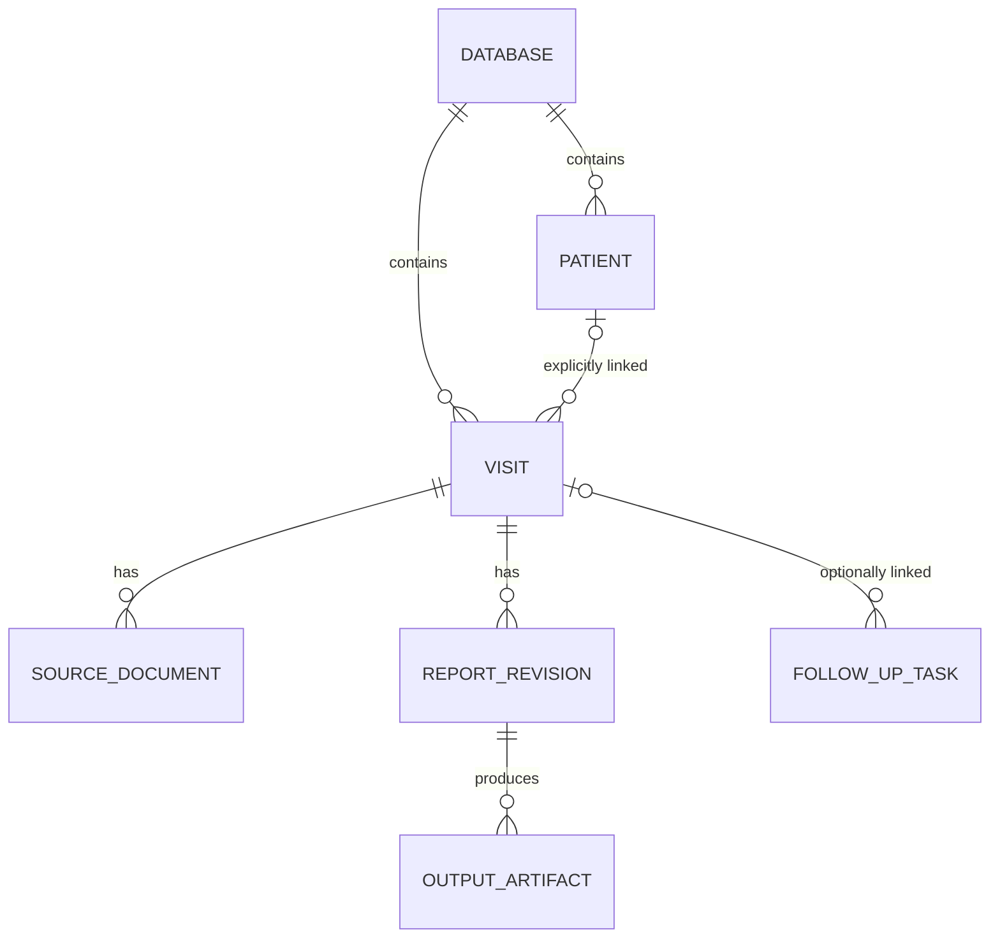

# Schedule, report generator, and PDF workspace review

September 7, 2026. Reviewed at commit `c774107`. This is a proposal; application behavior and database formats have not been changed.

## Recommendation

Build around an explicitly identified visit, a shared report model, and a persistent editing workspace. Preserve the compact clinical tables, keyboard behavior, full-width form, and optional source/report split. Introduce the foundations in separate migrations and releases.

The highest-value structural change is stable visit identity. The highest-value report change is generating all outputs from one versioned snapshot. The most immediately useful viewer work is search and remembered reading position, followed by source-page links.

Yesterday's task established these preferences: the left report sidebar was removed because it reduced table space on the MacBook/iPad setup; keyboard entry was improved; the redactor should remain separate; manual correction needs to stay fast. Previous-visit comparison and optional follow-up documentation were suggested but not implemented. This proposal carries those preferences forward.

## What the current implementation already does well

- The embedded report shares the Schedule's live `CRMWorkspace`. A proposal to share that database instance would duplicate existing work (`src/crmdb-store.js:26`).
- The store already has revision compare-and-swap, a journal of changed file paths, separate commit/file-write queues, reconnect freshness checks, and optional encrypted containers. Its serializer reuses unchanged blobs and cached CRCs. These mechanisms should be preserved through any migration.
- The PDF viewer already has page snapping, zoom/pan, selectable text, bookmarks or thumbnails, print/download, and bounded page rendering. Preserve these features.
- Schedule reminders, the all-patients overview, provider filters, Done, and Cerner status already exist. New work should improve their relationships and navigation.
- The current report form fits a 700px browser viewport without page-level horizontal overflow in a synthetic dual-chamber configuration. This is a limited browser check, not proof of every device mode or the physical iPad layout.

## 1. Separate patient, visit, document, and report identity

**Current evidence.** The schedule is `dates[date] -> row[]`; newly added rows have no stable identifier (`Patient_Schedule.html:524`, `:944`). The document folder is derived from date, time, and normalized patient name (`crmdb-store.js:251`). The report generator finds the first schedule row with a matching derived slot (`CRM_Report_Generator.html:3712`). Name/time changes trigger attachment relocation (`Patient_Schedule.html:2005`). The all-patients view lists dated appointments rather than a patient registry (`:1093`).

**Confirmed synthetic reproduction.** At 08:00, `Demo, A-B` and `Demo, AB` both produce `0800_DEMOAB`. Empty rows both produce `0000_XX`. Calling `moveSlot` into an existing destination replaces a same-named destination file with the source file (`crmdb-store.js:1321`). These checks ran against in-memory synthetic blobs; no patient database was opened or changed. They demonstrate key collision and overwrite behavior, not that an actual patient collision has occurred.

**Proposed model.**



| Record | Core information |
|---|---|
| Database | Stable ID, schema version, settings, portable-file revision |
| Patient | Stable ID, explicitly verified identity, current demographics |
| Visit | Stable ID, optional patient ID, date/time, provider, check type, identity snapshot, workflow state |
| Source document | Stable ID, visit ID, original filename, media type, document role, immutable bytes |
| Report revision | Visit ID, revision, structured measurements, narrative, source references, review information |
| Output artifact | Report revision, renderer version, output type, bytes |
| Follow-up task | Existing reminder text/completion plus optional visit/patient link, owner, due date |

Start with `databaseId` and `visitId`. A patient registry can follow when history/reuse is wanted. Moving an appointment changes visit metadata and its date index; it does not move report files. Human-friendly download names remain independent of internal storage keys. Document roles such as programmer source, prior office report, and generated report replace inference from filenames.

Do not automatically merge people by name. Allow explicit linking of historical visits with available identifying information and provenance. Preserve a demographics/device snapshot on each visit so a later name correction or generator replacement does not rewrite an old report. Cross-visit lead comparisons eventually need an explicit lead identity, not just an RA/RV/LV row position.

**Migration boundary.** Read legacy bundles without modifying them. Generate a migration inventory mapping every legacy folder to candidate visits, including orphan folders and ambiguous duplicate slots. Stop automatic association for ambiguous cases. Save a new versioned copy, reopen and validate it, compare attachment hashes/counts, and retain the original. Readers must reject unknown future schema versions instead of normalizing them to version 1. The old application must not write the new format.

**Tradeoff.** This touches routing, file attachment, retention, export, and schedule lookup. It is the largest compatibility change, so isolate it from visual redesign and storage-engine changes.

## 2. Give the report a data model independent of the HTML

**Current evidence.** `collectFormData` serializes DOM IDs/names with prefixes such as `r:`, `c:`, and `n:` and separate dynamic-row arrays (`CRM_Report_Generator.html:1360`). Vector PDF, print HTML, and summary text have separate readers/builders (`:1654`, `:1894`, `:2405`). Rebuilding a stored report from the Schedule can require a hidden report-generator iframe (`Patient_Schedule.html:2720`). This ties report production to a live form and its initialization order.

**Proposed flow.**

```text
Vendor parsers ----> import adapter ----> proposed field changes
Manual edits --------------------------> current report draft
                                              |
                                     immutable report snapshot
                                              |
                                    shared report sections
                                      /        |        \
                                    PDF     print     text / RTF
```

Extract an adapter around the existing saved shape first. Preserve legacy JSON import/export and existing parser behavior. Then move the common clinical content and inclusion rules into pure functions, with renderers responsible for formatting. Do not try to share PDF and HTML drawing/layout code.

A measurement should retain its display value (including comparators), unit, relevant context, and optional source reference. Imported provenance should include document ID and page when available, parser version, review status, and the original proposed value. Several current parsers already emit page hints through `src`; others emit descriptions such as `vendor`, `leads`, or `from model`, so page links need a structured adapter and honest fallback. Exact highlights require additional coordinates and source identity.

The current `prefillForm` uses review flags for the import message but does not retain a persistent field-level provenance model (`:2916`). Keep source actions small and optional. An edited field keeps its manual value when another import proposes a different value; show a difference only where replacement is at issue. Add session Undo for import/reset operations. Preserve blank-field omission and current manual workflows.

Build PDF, TXT, and RTF from the same captured revision. Publish the complete output set only after all generation succeeds and the underlying revision is still current. Failure must leave the prior valid set available and label it as older. The current separate `writeFile` calls in `finalizeReports` are not an explicit all-or-nothing artifact transaction (`:3562`).

**What this unlocks.** Previous/current comparison, explicit technical limitations, optional follow-up and reviewed-with/action-taken fields, and a technician-selected summary of notable findings can be implemented once and appear consistently across output formats. Prior data should be shown for comparison; do not copy old measurements into today's blank fields automatically. Display dates, units, pulse width or measurement context, and device/lead changes before offering any derived difference. Follow-up intervals and clinical conclusions remain user-entered.

**Tradeoff.** Every output can regress during extraction. Characterize current output with representative synthetic device configurations, compare substantive sections across formats, and visually review generated PDFs before switching renderers.

## 3. Make the schedule a work queue and preserve editing context

Keep the day-sheet table and printable schedule. Add compact views for precharting, report work, and closeout that change visible columns/filters, while sharing the same visit records. Current day-row filtering is by provider (`Patient_Schedule.html:644`); an unfinished-work view should combine provider, visit date, and workflow state without losing the user's place.

The report workspace should have one patient/visit header with database save state and a return-to-schedule action. The content area retains the report/source split and adjustable divider. A compact source selector can offer the current programmer document, explicitly selected prior visit, and generated output. A Next unfinished action respects the active queue and waits for the current draft to be saved before switching. Source rendering must use a request token plus visit/document identity so a delayed response cannot populate the next visit's view.

The current iframe reuse is a useful first stage. Extract shared services before deciding whether to replace the report iframe. A framework migration is not a prerequisite. The existing schedule and report HTML files are approximately 194 KB and 251 KB; the important boundary is responsibility and state ownership, not file size alone.

**Workflow state should reference revisions.** Current `done` and `cerner` are independent row booleans. The Done handler deliberately does not mark the report dirty (`CRM_Report_Generator.html:3791`). Consider recording `completedRevision` and `uploadedRevision` alongside timestamps. A material edit after completion can then show “Changed since completion” and “Newer than uploaded copy,” preserving the historical upload record. File existence and successful PDF generation must not automatically mean clinical completion. Cerner upload remains manual acknowledgement because the app cannot verify it.

Existing reminders can gain optional visit links, owners, and due dates. Keep quick free-text entry. A linked follow-up list provides cross-day continuity without forcing every reminder into a patient record.

**Tradeoff.** Extra statuses can become busywork. Derive document presence and output freshness automatically; reserve manual actions for completion, acknowledgement, and follow-up decisions. Prototype the header/queue flow before changing the full schedule table.

## 4. Extend the PDF viewer as a reading tool

| Addition | Value | Implementation boundary |
|---|---|---|
| Document-wide search and result navigation | Find a label or value across a long source report | Search extracted text across pages, not only the visible text layer; scanned pages may have no searchable text |
| Remember page, zoom, and pan per source document | Resume reading after switching between source files | Key by database/document identity; invalidate on replacement; avoid names or source text in preference keys |
| Field-to-source page navigation | Check an imported value quickly | Use structured document/page references; do not assume every parser already provides coordinates |
| Explicit Fit page / Fit width | Read dense source tables in a narrow pane | Preserve current one-page mode; fit-width needs an intentional scrolling/pan design |
| Compact toolbar overflow | Leave room for reading at narrow widths | Keep navigation and zoom reachable without opening a permanent sidebar |

The viewer creates a new iframe when the selected source changes (`Patient_Schedule.html:2933`), and the viewer starts at page 1/zoom 1 (`PDF_Viewer.html:133`). Its page and text virtualization is worth retaining (`:228`). Search should cache a bounded text index and release it with the document. Exact passage highlighting follows page navigation, rather than holding all page canvases or DOM text layers alive.

Keep redaction separate, consistent with yesterday's decision. These changes concern reading and verification; no OCR or remote document processing is needed for the first version.

## 5. Separate frequent browser saves from portable-file publication

**Current evidence.** Edits stage in memory; the cadence publishes the serialized bundle to IndexedDB, and desktop file writes run on a separate queue (`crmdb-store.js:614`, `:645`, `:763`). Existing delta/CRC optimizations reduce work, but the committed IndexedDB value remains a complete container snapshot. Encryption serializes/encrypts the whole container. A report's slot draft can therefore remain only in memory until the cadence or an explicit handoff succeeds.

**Proposed progression.** First give save operations one contract and observable revisions: edited, saved in browser, saved to portable file, and failed/conflicted. The UI can expose this through one status control. “Saved to file” does not mean OneDrive has completed remote synchronization; an iPad share-sheet handoff cannot confirm that the user replaced the intended file.

Next, make the working store incremental: store changed report/visit records and attachment blobs separately in IndexedDB transactions, partitioned by database ID. Keep `.crmdb` as a portable snapshot assembled on an independent cadence or explicit Save. This reduces the cost of frequent recovery saves and avoids rebuilding a PDF merely to preserve entered values. Browser storage still requires quota/error handling and a portable recovery copy; it is not an unlimited archive. [IndexedDB transactions and storage guidance](https://developer.mozilla.org/en-US/docs/Web/API/IndexedDB_API/Using_IndexedDB).

Prepare expensive serialization/encryption outside short IndexedDB transactions, then check the expected revision before publishing. Preserve encryption for every persisted clinical record, attachment, draft, and retained revision when protection is enabled; splitting an encrypted bundle into plaintext browser records would be a regression. The working-store encryption design deserves its own review and tests.

Do not rely on page exit to finish asynchronous report building or saves. Browser suspension/termination can interrupt that work; lifecycle handlers are an additional attempt, not a completion guarantee. Save small changes while the page is active and await explicit in-app transitions. [Chrome page lifecycle guidance](https://developer.chrome.com/docs/web-platform/page-lifecycle-api).

**Concurrency boundary.** The existing journal merges file paths, not independent fields within the same `schedule.json` or `report.json`. Stable IDs alone do not change that. Introduce expected revisions and explicit same-record conflict handling; initially, an editor lease with stale-owner recovery may be simpler than automatic field merging. Database IDs must also namespace messages and cached state. Moving a portable file between computers remains a single-writer handoff unless a separate synchronization system is designed.

**Tradeoff.** This changes crash recovery, encryption, migration, and cross-tab behavior. Make it a distinct later phase. SQLite, a hosted backend, or a new UI framework would not by themselves resolve these ownership and publication issues.

## Near-term correctness work exposed by the review

1. Refuse ambiguous slot/file destinations until stable visit IDs are available. The synthetic collision/overwrite is confirmed above.
2. Keep the editor open when finalization fails. `closePanel` currently reports the error and then calls `destroyPanel` anyway (`Patient_Schedule.html:2783`). This is a code-inspection finding; failure injection should characterize exactly what draft work remains recoverable before changing it. Time/name edits also call `closePanel` without awaiting its completion before `moveSlot` (`:2024`).
3. Test delayed load/switch behavior before centralizing the workspace. `openSlot` starts asynchronous reads against mutable slot state (`CRM_Report_Generator.html:3807`), and source-view loading checks whether a panel exists rather than verifying the original panel/document request. These are candidates for targeted race tests, not a claim of a reproduced wrong-patient incident.

These bounded fixes can precede the architecture changes. They should not require a full redesign release.

## Suggested implementation order and acceptance criteria

| Phase | Deliverable | Acceptance gate |
|---|---|---|
| 0 | Destination-collision and failed-close guards | Duplicate slots cannot overwrite files; failed finalization preserves the editor and supports retry |
| 1 | Database/visit IDs plus legacy adapter | Rename/reschedule preserves associations; ambiguous legacy folders are surfaced; old bytes remain available |
| 2 | Shared report snapshot and output service | PDF, print, TXT, and RTF contain equivalent populated facts; failed builds preserve previous valid artifacts |
| 3 | Search/reading-state improvements and workspace prototype | Keyboard entry, source switching, and next-visit navigation remain stable at actual pane widths |
| 4 | Revision-based completion and optional linked history/tasks | Edits identify outdated exports; prior visits are explicitly linked; historical reports remain unchanged |
| 5 | Incremental working store | Small edits do not rewrite unrelated attachments; encryption, recovery, quota failure, and two-tab conflicts pass integration tests |

Phases 1 and 2 are foundational. Viewer search can ship independently if it addresses the most immediate friction. Measure database size, save latency, longest source PDFs, and the actual use of simultaneous tabs before deciding when phase 5 is justified. Retention must define how deleting visits affects linked tasks, source files, and historical snapshots; introducing history should not silently make the database retain everything forever.

## Verification and scope

- Reviewed yesterday's task, repository history, schedule/report/viewer code, parsers, storage engine, and related tests.
- Ran the complete existing suite: **42 test files passed**.
- Browser inspection used a separate localhost origin with synthetic/blank data. Checked a schedule row and standalone report at 1280px and a 700px pane-sized viewport; reset the viewport afterward.
- Reproduced normalized-slot collision and destination overwrite with synthetic in-memory blobs.
- Did not open real patient records, alter an existing `.crmdb`, run a physical iPad test, or test a populated split-view document in this review.
- Several UI tests inspect source patterns. Their passing status does not establish real browser behavior under tab termination, delayed I/O, or all output layouts. Future migration tests must exercise behavior and round trips.
- The original `protected/crmdb-container-design.md` is explicitly a historical sketch; its JSZip and save-cadence examples do not describe today's engine. Use current code and tests as the baseline, and update handoff documentation as each phase lands.

Only this review document was added. No application changes, commits, database migrations, or deployments were performed.
