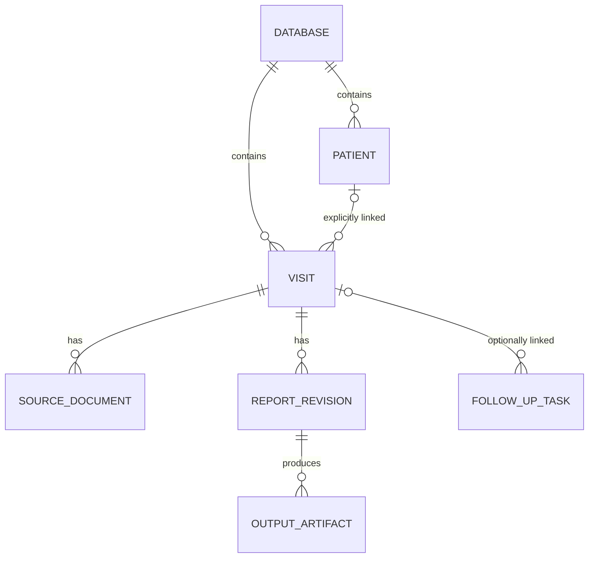

# Schedule, report generator, and PDF workspace review

September 7, 2026. Original review at commit `c774107`. The first viewer increment below is now implemented locally; the remaining architecture sections are proposals. Database formats have not changed.

## Current priorities, revised after user feedback

The intended database retention is seven days. Prior-report comparison is out of scope; the user primarily does that in Cerner. Patient identity restructuring and collision prevention are lower priority given the actual workflow. They are not prerequisites for viewer improvements.

1. PDF viewer navigation, especially quick access to episode EGM pages during manual report entry.
2. Schedule workflow improvements (the original recommendation #3).
3. Shared PDF/TXT/RTF content remains a separate possible improvement, with no dependency on historical comparisons.

The essential viewer behaviors are the split pane beside the editable report, one document page per physical mouse-wheel notch, and fit-to-page so the whole page is visible. Preserve these while adding navigation. Keep the report's removed sidebar out of the design and retain keyboard-entry improvements. The redactor stays separate.

## First viewer increment: implemented scope

Revised after use. The report's **EGM pages** button and the viewer's heading-detection overlay are
both gone: the split pane already shows the document, and an auto-detected "possible recording"
list added clutter rather than navigation. Nothing now infers that a page holds a recording.

Vertical space for the document is the point, so the shortcuts cost no toolbar height. The viewer's
**Chrome viewer** button is removed and its slot holds an **EGM** button whose count is the only
always-visible state (`EGM`, `EGM · 2`). It opens a popover floating over the document: a
destination picker (Unassigned page, or a logbook entry), **Save page N**, and the saved pages, each
a jump button with a × beside it. Saving or choosing a destination closes it; Escape, an outside
click, or the button itself also close it. The single toolbar row is back to 38px, so the document
keeps the 32px the old second bar took. A **Back to p. N** button appears in the toolbar only after
a jump, and restores the page, zoom, and pan saved before it.

Destinations are named the way the logbook names them — `#1 08/22/2026 09:18PM NS-VT`, the "#"
column first, then the entry's date/time and checked episode types, falling back to `#N` alone for
a still-empty row. The date is read straight off the `datetime-local` string, so no time zone is
applied. Labels follow edits to the row.

In the report, the episode's row number **is** the jump control: plain grey until that entry has a
page, then navy and clickable, with the source filename and page in its tooltip. Print keeps it
plain. The separate `p. N` button is gone.

A page saved without an entry persists too, in one hidden `egm-marks` field carrying the source
filename and PDF fingerprint. It rides the report JSON exactly like the per-entry links, survives
reopening, follows existing retention, and never reaches PDF/TXT/RTF content. Assigning a page to
an entry drops its anonymous copy; × clears the page's entry links in both device-mode tables and
its unassigned copy together.

Ordinary wheel paging, fit-to-page, and the split widths are untouched — a jump does not resize
either pane. Late source loads and navigation messages are still checked against the active
frame/document, and a missing or replaced source cannot silently reuse a link. Search, remembered
document positions, and recording-group navigation remain follow-up work.

Validation is the automated suite plus a synthetic split-pane browser check against a generated
six-page PDF. The unit tests cover label formatting, assignment from the picker, unassigned saves
and their de-duplication, source identity, removal, report JSON round-trip, the destination list,
open/close behaviour, Back restoring page/zoom/pan, and a background republish not rewriting the
picker while it is in use. The browser check confirmed the single-row toolbar, one wheel notch per
page, the entry-named picker and destination list, the row number jumping and raising Back to p. N,
`egm-marks` surviving `collectFormData`/`applyFormData`, and no fingerprint text reaching the
summary output. No clinical source files or databases were opened.

## Broader viewer design for reference

Superseded where it conflicts with the implemented scope above: there is no overlay, no EGM pages
button beside the episode table, and no heading-based detection. The paragraphs below are kept for
the reasoning they record about indexing, honest fallbacks, and navigation boundaries.

Use an **EGMs** toolbar action and a matching **EGM pages** action beside the report's episode table. Both open the same document-local overlay with page numbers, source headings, and entry assignments. The overlay closes on page selection without narrowing either pane. Distinguish an episode summary/list from pages containing detailed recordings.

Build the navigation index locally from PDF bookmarks and extracted page text. Treat headings and repeated vendor-specific recording labels as evidence; a passing mention of an EGM, the table of contents, or an episode count alone should not classify a page as a recording. Group continuation pages where supported by source evidence. Label uncertain destinations as possible matches. If no match is found, say **No EGM pages detected**, not that the document contains none. A waveform rendered as an image can still have a searchable heading; a fully scanned page may have no useful text.

Offer a manual current-page fallback and a right-side × for removal. Explicit user assignments belong to the exact source document and follow the report's existing retention. Do not create a permanent history store or infer a particular episode's recording from a heading alone.

Use explicit Previous/Next EGM controls for jumping between indexed destinations. The ordinary wheel must continue moving through adjacent PDF pages, including recording continuation pages; it must not silently become an EGM-only filter. Preserve the selected fit/zoom mode. Add a Return action to restore the prior reading position after an EGM jump. Navigation happens only on an explicit click, never merely because the technician focuses or edits an episode field.

Use the existing viewer's `goTo` paging path and bounded rendering. Index text incrementally without retaining all canvases or full-document text-layer DOM. Begin displaying the document before indexing is complete. Cancel obsolete indexing/navigation work when the patient or attachment changes, and check source window, document identity, and request identity for report-to-viewer messages.

The next viewer additions would be document-wide search and remembered page/zoom/pan while a source remains available. Fit-width and broader field-to-source highlighting are deferred; they do not address the primary EGM-navigation need.

Acceptance: manual episode entry and viewer navigation work together in split view; EGM jumps do not resize the panes; one wheel notch advances one document page; Fit still shows the complete page; ambiguous or scanned reports have an honest manual fallback; switching documents cannot reuse the previous document's matches or marks. Validate detection against redacted examples of the user's actual programmer exports before describing it as reliable.

The remaining sections retain the original architecture analysis for reference. Their earlier sequence and history-related proposals are deferred and do not override the priorities above.

## What the current implementation already does well

- The embedded report shares the Schedule's live `CRMWorkspace`. A proposal to share that database instance would duplicate existing work (`src/crmdb-store.js:26`).
- The store already has revision compare-and-swap, a journal of changed file paths, separate commit/file-write queues, reconnect freshness checks, and optional encrypted containers. Its serializer reuses unchanged blobs and cached CRCs. These mechanisms should be preserved through any migration.
- The PDF viewer already has page snapping, zoom/pan, selectable text, bookmarks or thumbnails, print/download, and bounded page rendering. Preserve these features.
- Schedule reminders, the all-patients overview, provider filters, Done, and Cerner status already exist. New work should improve their relationships and navigation.
- The current report form fits a 700px browser viewport without page-level horizontal overflow in a synthetic dual-chamber configuration. This is a limited browser check, not proof of every device mode or the physical iPad layout.

## 1. Separate patient, visit, document, and report identity

**Current evidence.** The schedule is `dates[date] -> row[]`; newly added rows have no stable identifier (`Patient_Schedule.html:524`, `:944`). The document folder is derived from date, time, and normalized patient name (`crmdb-store.js:251`). The report generator finds the first schedule row with a matching derived slot (`CRM_Report_Generator.html:3712`). Name/time changes trigger attachment relocation (`Patient_Schedule.html:2005`). The all-patients view lists dated appointments rather than a patient registry (`:1093`).

**Confirmed synthetic reproduction.** At 08:00, `Demo, A-B` and `Demo, AB` both produce `0800_DEMOAB`. Empty rows both produce `0000_XX`. Calling `moveSlot` into an existing destination replaces a same-named destination file with the source file (`crmdb-store.js:1321`). These checks ran against in-memory synthetic blobs; no patient database was opened or changed. They demonstrate key collision and overwrite behavior, not that an actual patient collision has occurred.

**Proposed model.**



| Record | Core information |
|---|---|
| Database | Stable ID, schema version, settings, portable-file revision |
| Patient | Stable ID, explicitly verified identity, current demographics |
| Visit | Stable ID, optional patient ID, date/time, provider, check type, identity snapshot, workflow state |
| Source document | Stable ID, visit ID, original filename, media type, document role, immutable bytes |
| Report revision | Visit ID, revision, structured measurements, narrative, source references, review information |
| Output artifact | Report revision, renderer version, output type, bytes |
| Follow-up task | Existing reminder text/completion plus optional visit/patient link, owner, due date |

Start with `databaseId` and `visitId`. A patient registry can follow when history/reuse is wanted. Moving an appointment changes visit metadata and its date index; it does not move report files. Human-friendly download names remain independent of internal storage keys. Document roles such as programmer source, prior office report, and generated report replace inference from filenames.

Do not automatically merge people by name. Allow explicit linking of historical visits with available identifying information and provenance. Preserve a demographics/device snapshot on each visit so a later name correction or generator replacement does not rewrite an old report. Cross-visit lead comparisons eventually need an explicit lead identity, not just an RA/RV/LV row position.

**Migration boundary.** Read legacy bundles without modifying them. Generate a migration inventory mapping every legacy folder to candidate visits, including orphan folders and ambiguous duplicate slots. Stop automatic association for ambiguous cases. Save a new versioned copy, reopen and validate it, compare attachment hashes/counts, and retain the original. Readers must reject unknown future schema versions instead of normalizing them to version 1. The old application must not write the new format.

**Tradeoff.** This touches routing, file attachment, retention, export, and schedule lookup. It is the largest compatibility change, so isolate it from visual redesign and storage-engine changes.

## 2. Give the report a data model independent of the HTML

**Current evidence.** `collectFormData` serializes DOM IDs/names with prefixes such as `r:`, `c:`, and `n:` and separate dynamic-row arrays (`CRM_Report_Generator.html:1360`). Vector PDF, print HTML, and summary text have separate readers/builders (`:1654`, `:1894`, `:2405`). Rebuilding a stored report from the Schedule can require a hidden report-generator iframe (`Patient_Schedule.html:2720`). This ties report production to a live form and its initialization order.

**Proposed flow.**

```text
Vendor parsers ----> import adapter ----> proposed field changes
Manual edits --------------------------> current report draft
                                              |
                                     immutable report snapshot
                                              |
                                    shared report sections
                                      /        |        \
                                    PDF     print     text / RTF
```

Extract an adapter around the existing saved shape first. Preserve legacy JSON import/export and existing parser behavior. Then move the common clinical content and inclusion rules into pure functions, with renderers responsible for formatting. Do not try to share PDF and HTML drawing/layout code.

A measurement should retain its display value (including comparators), unit, relevant context, and optional source reference. Imported provenance should include document ID and page when available, parser version, review status, and the original proposed value. Several current parsers already emit page hints through `src`; others emit descriptions such as `vendor`, `leads`, or `from model`, so page links need a structured adapter and honest fallback. Exact highlights require additional coordinates and source identity.

The current `prefillForm` uses review flags for the import message but does not retain a persistent field-level provenance model (`:2916`). Keep source actions small and optional. An edited field keeps its manual value when another import proposes a different value; show a difference only where replacement is at issue. Add session Undo for import/reset operations. Preserve blank-field omission and current manual workflows.

Build PDF, TXT, and RTF from the same captured revision. Publish the complete output set only after all generation succeeds and the underlying revision is still current. Failure must leave the prior valid set available and label it as older. The current separate `writeFile` calls in `finalizeReports` are not an explicit all-or-nothing artifact transaction (`:3562`).

**What this unlocks.** Previous/current comparison, explicit technical limitations, optional follow-up and reviewed-with/action-taken fields, and a technician-selected summary of notable findings can be implemented once and appear consistently across output formats. Prior data should be shown for comparison; do not copy old measurements into today's blank fields automatically. Display dates, units, pulse width or measurement context, and device/lead changes before offering any derived difference. Follow-up intervals and clinical conclusions remain user-entered.

**Tradeoff.** Every output can regress during extraction. Characterize current output with representative synthetic device configurations, compare substantive sections across formats, and visually review generated PDFs before switching renderers.

## 3. Make the schedule a work queue and preserve editing context

Keep the day-sheet table and printable schedule. Add compact views for precharting, report work, and closeout that change visible columns/filters, while sharing the same visit records. Current day-row filtering is by provider (`Patient_Schedule.html:644`); an unfinished-work view should combine provider, visit date, and workflow state without losing the user's place.

The report workspace should have one patient/visit header with database save state and a return-to-schedule action. The content area retains the report/source split and adjustable divider. A compact source selector can offer the current programmer document, explicitly selected prior visit, and generated output. A Next unfinished action respects the active queue and waits for the current draft to be saved before switching. Source rendering must use a request token plus visit/document identity so a delayed response cannot populate the next visit's view.

The current iframe reuse is a useful first stage. Extract shared services before deciding whether to replace the report iframe. A framework migration is not a prerequisite. The existing schedule and report HTML files are approximately 194 KB and 251 KB; the important boundary is responsibility and state ownership, not file size alone.

**Workflow state should reference revisions. First step implemented, reshaped by how Done is actually used.** Done is a personal end-of-day marker — the user completes reports in the app, ticks Done for their own tracking, then runs Download patients once to get the structured folder they import into Cerner. So the useful signal is not per-patient upload tracking but whether a report moved on after being called finished. Rows now carry `doneAt` (when it was ticked) and `doneStale` (it was edited afterwards) beside the existing `done` boolean; both pages stamp them through one `pushRowFields` writer, and unticking clears them. Only the report's typing-pause live sync ages a tick, gated on `isTrusted` input so restoring a slot cannot do it, and deliberately NOT `finalizeReports` — which merely materializes what is already there, so hooking it would flag ticking Done and closing as an edit. The Schedule shows an `edited` marker on the row and answers the end-of-day question in the day's counts: how many reports are left, and how many need another look. A per-patient Cerner upload revision was deliberately NOT added, because the export is a single bulk action rather than a per-visit one; marking the exported folder stale after a later edit is the natural follow-up. A material edit after completion can then show “Changed since completion” and “Newer than uploaded copy,” preserving the historical upload record. File existence and successful PDF generation must not automatically mean clinical completion. Cerner upload remains manual acknowledgement because the app cannot verify it.

Existing reminders can gain optional visit links, owners, and due dates. Keep quick free-text entry. A linked follow-up list provides cross-day continuity without forcing every reminder into a patient record.

**Tradeoff.** Extra statuses can become busywork. Derive document presence and output freshness automatically; reserve manual actions for completion, acknowledgement, and follow-up decisions. Prototype the header/queue flow before changing the full schedule table.

## 4. Extend the PDF viewer as a reading tool

| Addition | Value | Implementation boundary |
|---|---|---|
| Document-wide search and result navigation | Find a label or value across a long source report | Search extracted text across pages, not only the visible text layer; scanned pages may have no searchable text |
| Remember page, zoom, and pan per source document | Resume reading after switching between source files | Key by database/document identity; invalidate on replacement; avoid names or source text in preference keys |
| Field-to-source page navigation | Check an imported value quickly | Use structured document/page references; do not assume every parser already provides coordinates |
| Explicit Fit page / Fit width | Read dense source tables in a narrow pane | Preserve current one-page mode; fit-width needs an intentional scrolling/pan design |
| Compact toolbar overflow | Leave room for reading at narrow widths | Keep navigation and zoom reachable without opening a permanent sidebar |

The viewer creates a new iframe when the selected source changes (`Patient_Schedule.html:2933`), and the viewer starts at page 1/zoom 1 (`PDF_Viewer.html:133`). Its page and text virtualization is worth retaining (`:228`). Search should cache a bounded text index and release it with the document. Exact passage highlighting follows page navigation, rather than holding all page canvases or DOM text layers alive.

Keep redaction separate, consistent with yesterday's decision. These changes concern reading and verification; no OCR or remote document processing is needed for the first version.

## 5. Separate frequent browser saves from portable-file publication

**Current evidence.** Edits stage in memory; the cadence publishes the serialized bundle to IndexedDB, and desktop file writes run on a separate queue (`crmdb-store.js:614`, `:645`, `:763`). Existing delta/CRC optimizations reduce work, but the committed IndexedDB value remains a complete container snapshot. Encryption serializes/encrypts the whole container. A report's slot draft can therefore remain only in memory until the cadence or an explicit handoff succeeds.

**Proposed progression. The first step is now implemented.** The store exposes a typed save contract — `closed / edited / saving / browser / file / blocked / failed` — through `CRMWorkspace.saveState` and `onSaveState`, emitted at every real transition (stage, commit, write-through, freshness refusal, failure) and derived from the existing flags for opens and reconnects, which move them without a transition of their own. Subscribing delivers the current value immediately. Crucially a failure is **sticky**: editing does not clear it, only a save that actually lands does, which is what `onStatus` could never manage because the next message overwrote it. The Schedule renders it in one always-current control, mirrored into the split panel's header because split view covers the whole viewport and report entry is exactly when the edits happen. The Database button's dot answers a deliberately DIFFERENT question from the pill — is the database connected and healthy — because the Schedule stages edits and publishes on a 30 second cadence, so `edited` and `saving` are the normal state for most of any minute. Driving the dot from the pill's exact state was briefly tried and reverted: it left a perfectly connected database showing grey for half a minute after every keystroke, which reads as a dropped connection and sent the user looking for a reconnect problem that did not exist. Ordinary editing is green; amber means the portable file genuinely lacks the work; red means something is broken. The dot no longer echoes the last status message's severity, which had made it stay green through every keystroke after a save and turn green on unrelated successes such as enabling password protection or exporting to Downloads. The dot and the labelled control are one signal and cannot disagree; setStatus keeps the message text and the warning banner. The wording states the limits the doc calls for: `browser` says the .crmdb does not have the changes, and `file` says written to the file is not proof OneDrive finished syncing. `tests/crmdb-save-state.test.js` drives the real store against a fake IndexedDB and pins the sticky-failure property. Still to do in this section: the incremental working store, preparing serialization outside the transaction, and same-record conflict handling. “Saved to file” does not mean OneDrive has completed remote synchronization; an iPad share-sheet handoff cannot confirm that the user replaced the intended file.

**A durable journal is now implemented, which closes the loss window without touching the cadence.** A commit rewrites the whole container, so it stays on its 30 second cadence; the same pending changes are additionally written to IndexedDB as they happen and replayed on top of the committed bundle when the page returns. Closing Chrome with a report open no longer loses the edits. It is deliberately ONE sealed blob rather than a row per path: per-path rows would key IndexedDB by strings like `patients/2026-09-07/0800_DEMOAB/report.json` — date, appointment time and patient name in clear, outside the envelope that exists to protect exactly that — and would need thousands of IVs where AES-GCM forgives no reuse. One blob keeps filenames inside the ciphertext, uses one IV per write, and gives `forget()` a single thing to erase. Cost is O(pending changes), not O(database); attachments exceed a 4 MB cap and ride the container commit instead. Replay is conservative: the row must name the revision just loaded, and a stale, malformed or foreign-salted row is discarded rather than guessed at, so the fallback is always the previous behaviour. Verified by `tests/crmdb-journal.test.js` and in a real browser against real IndexedDB and WebCrypto: a staged edit survived a full page reload on a protected database, the sealed row contained no patient name, finding or path, a commit removed the row, and `forget()` left zero keys behind. Still open in this section: make the working store incremental — store changed report/visit records and attachment blobs separately in IndexedDB transactions, partitioned by database ID. Keep `.crmdb` as a portable snapshot assembled on an independent cadence or explicit Save. This reduces the cost of frequent recovery saves and avoids rebuilding a PDF merely to preserve entered values. Browser storage still requires quota/error handling and a portable recovery copy; it is not an unlimited archive. [IndexedDB transactions and storage guidance](https://developer.mozilla.org/en-US/docs/Web/API/IndexedDB_API/Using_IndexedDB).

Prepare expensive serialization/encryption outside short IndexedDB transactions, then check the expected revision before publishing. **Peak memory on a protected database is a measured concern, not a theoretical one:** a tab was observed peaking above 400 MB and dropping back straight after, which is the signature of a whole-container encrypt. WebCrypto has no streaming AES-GCM, so the database is unavoidably resident twice during `encryptZip` — plaintext and ciphertext both. It was resident a third time because the zip Blob stayed pinned by the function's parameter and by `serializeForCommit`'s `r`; both references are now dropped as soon as `arrayBuffer()` resolves, and `tests/crmdb-commit-cost.test.js` pins the shape so a refactor cannot quietly re-pin it. Opening was worse and is the bigger moment, because it is the one time the whole database is decrypted at once: it held FOUR copies — the container Blob pinned by the closure, its ArrayBuffer, a `slice()` copy of the ciphertext (slice copies; subarray does not), and the plaintext. It now holds two. Both peaks are therefore about 2x the database, and the remaining 2x is structural — only the incremental working store removes it, by not decrypting or re-encrypting the whole database because one field changed. Note the practical consequence of the current design: peak memory is a multiple of database SIZE, so it grows through a clinic day as reports and programmer PDFs are attached, and retention is what bounds it. This matters most on iPad, where iOS kills tabs for memory and the killed tab is exactly the one holding browser-only work. Preserve encryption for every persisted clinical record, attachment, draft, and retained revision when protection is enabled; splitting an encrypted bundle into plaintext browser records would be a regression. The working-store encryption design deserves its own review and tests.

**Leaving the station is the case the journal cannot cover, and it now asks.** The journal keeps work safe in the browser, and the browser stays on the machine you walked away from; what travels is the `.crmdb`. Closing the window while the file is behind therefore leaves a finished report at that clinic. A `beforeunload` guard asks before the window closes, and starts the save while the browser draws its dialog, so choosing Leave is usually already safe and staying resolves the indicator on its own. It is deliberately narrow, because a prompt that fires often is a prompt people click through: only with a bound file, only when that file is genuinely behind, and never in a read-only tab. Without a bound file (iPad) the work is on the device travelling with the user, and the save indicator carries that case instead. This is a backstop, not a guarantee. Do not rely on page exit to finish asynchronous report building or saves. Browser suspension/termination can interrupt that work; lifecycle handlers are an additional attempt, not a completion guarantee. Save small changes while the page is active and await explicit in-app transitions. [Chrome page lifecycle guidance](https://developer.chrome.com/docs/web-platform/page-lifecycle-api).

**Concurrency boundary. The editor lease is now implemented, and it is a lease rather than a merge for exactly the reason this section gives.** One tab per database writes; a second opens read-only. The primitive is Web Locks, chosen because the browser releases a held lock when a tab dies — that removes stale-owner recovery, the part of a lease easiest to get wrong, with no heartbeat to tune and no judgement call about whether silence means a crash. A reader queues a normal request and is promoted automatically when the writer closes; closing the database releases the lease too, rather than making a waiting tab wait for the page. A reader commits nothing, journals nothing and writes no file, reports `readonly` through the save contract, and the Schedule disables editing behind a banner — an indicator alone would let someone fill in a whole report that goes nowhere. Anything a reader staged in memory is discarded on promotion rather than replayed onto the copy the previous writer left. Without Web Locks the store fails open to the previous behaviour and reports `supported: false` rather than implying protection it does not have; the compare-and-swap and journal rebase underneath remain the net for that case, which is what `tests/crmdb-multitab.test.js` now explicitly covers. Verified by `tests/crmdb-writer-lease.test.js` and with two real browser tabs on the Schedule. Still open: expected revisions and same-record conflict handling for the case a lease cannot reach — two devices editing one OneDrive file, which is a handoff rather than a tab. Database IDs must also namespace messages and cached state. Moving a portable file between computers remains a single-writer handoff unless a separate synchronization system is designed.

**Tradeoff.** This changes crash recovery, encryption, migration, and cross-tab behavior. Make it a distinct later phase. SQLite, a hosted backend, or a new UI framework would not by themselves resolve these ownership and publication issues.

## Near-term correctness work exposed by the review

1. **Done.** `moveSlot` now refuses a destination that already holds files instead of copying over them, with a message the caller shows. `relocateSlotFiles` no longer advances `preSlot` on a refused move either — that bug was latent until the guard exposed it, and advancing the baseline would have pointed the row at an empty folder and orphaned the real one. `tests/crmdb-slot-collision.test.js` proves both patients keep their files, that a free destination still moves, and that an empty source is not treated as occupied. The underlying key collision (distinct names normalizing to one slot) still needs stable visit IDs; refusing the destructive move is the bounded fix available without them.
2. **Done.** A failed rebuild no longer destroys the editor. `closePanel` now asks before discarding: declining keeps the panel, its frame, and its unstaged work, warns that the close can be retried, and does not run the caller's continuation, so opening another patient leaves the failed one on screen instead of replacing it. Confirming closes and says plainly that the report files were not rebuilt. The time/name edit path is now `relocateSlotFiles`, which waits for the close to finish before calling `moveSlot` and abandons the move entirely when the close is refused — the files stay where the still-open editor expects them, and `preSlot` keeps naming the folder they are really in so a later edit can retry. `tests/schedule-close-failure.test.js` runs the real extracted functions against injected collaborators and characterizes both outcomes; the schedule page was loaded in a browser to confirm it still boots clean. Two sibling paths still destroy the panel without consulting a finalize error: `crm:collapse` (`:3123`, which never finalizes) and the expand-to-full-page action (`:3137`, which discards the error argument). Neither loses the editor the way `closePanel` did, but the full-page path deserves the same treatment.
3. Test delayed load/switch behavior before centralizing the workspace. `openSlot` starts asynchronous reads against mutable slot state (`CRM_Report_Generator.html:3807`), and source-view loading checks whether a panel exists rather than verifying the original panel/document request. These are candidates for targeted race tests, not a claim of a reproduced wrong-patient incident.

These bounded fixes can precede the architecture changes. They should not require a full redesign release.

## Earlier architecture sequence (deferred; not the current work order)

| Phase | Deliverable | Acceptance gate |
|---|---|---|
| 0 | Destination-collision and failed-close guards | Duplicate slots cannot overwrite files; failed finalization preserves the editor and supports retry |
| 1 | Database/visit IDs plus legacy adapter | Rename/reschedule preserves associations; ambiguous legacy folders are surfaced; old bytes remain available |
| 2 | Shared report snapshot and output service | PDF, print, TXT, and RTF contain equivalent populated facts; failed builds preserve previous valid artifacts |
| 3 | Search/reading-state improvements and workspace prototype | Keyboard entry, source switching, and next-visit navigation remain stable at actual pane widths |
| 4 | Revision-based completion and optional linked history/tasks | Edits identify outdated exports; prior visits are explicitly linked; historical reports remain unchanged |
| 5 | Incremental working store | Small edits do not rewrite unrelated attachments; encryption, recovery, quota failure, and two-tab conflicts pass integration tests |

Phases 1 and 2 are foundational. Viewer search can ship independently if it addresses the most immediate friction. Measure database size, save latency, longest source PDFs, and the actual use of simultaneous tabs before deciding when phase 5 is justified. Retention must define how deleting visits affects linked tasks, source files, and historical snapshots; introducing history should not silently make the database retain everything forever.

## Verification and scope

- Reviewed yesterday's task, repository history, schedule/report/viewer code, parsers, storage engine, and related tests.
- Ran the complete existing suite: **42 test files passed**.
- Browser inspection used a separate localhost origin with synthetic/blank data. Checked a schedule row and standalone report at 1280px and a 700px pane-sized viewport; reset the viewport afterward.
- Reproduced normalized-slot collision and destination overwrite with synthetic in-memory blobs.
- Did not open real patient records, alter an existing `.crmdb`, run a physical iPad test, or test a populated split-view document in this review.
- Several UI tests inspect source patterns. Their passing status does not establish real browser behavior under tab termination, delayed I/O, or all output layouts. Future migration tests must exercise behavior and round trips.
- The original `protected/crmdb-container-design.md` is explicitly a historical sketch; its JSZip and save-cadence examples do not describe today's engine. Use current code and tests as the baseline, and update handoff documentation as each phase lands.

At the original review, only this document was added. The implementation scope above describes subsequent local viewer changes; no database migration or deployment was performed.
